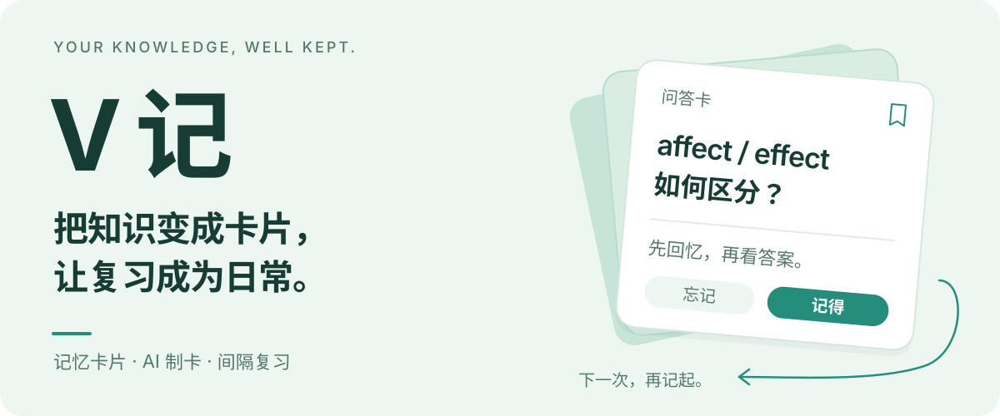
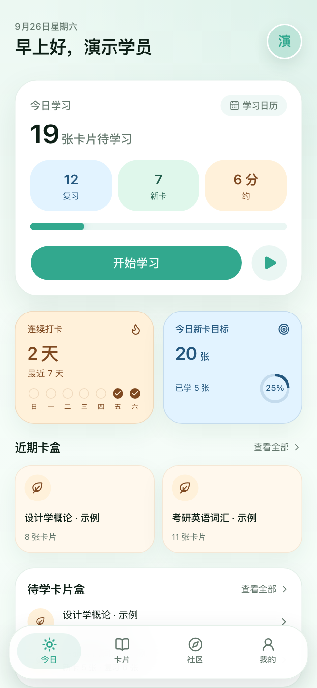
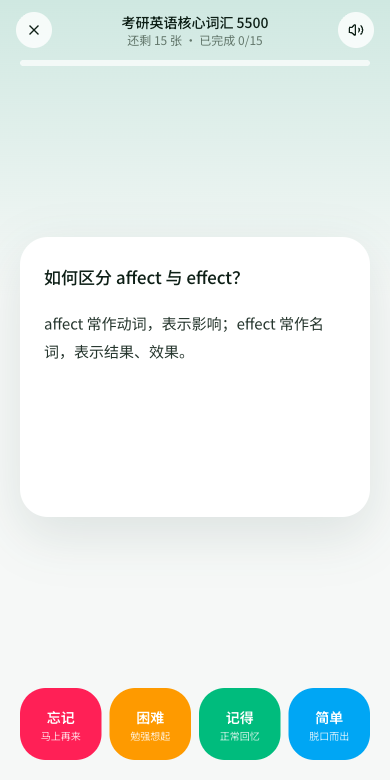

<p align="center">
  
</p>

**V 记**是一款以卡片为中心的学习工具。把知识整理成问题，先回忆、再看答案，再根据记忆情况安排下一次复习。支持手动制卡、AI 生成草稿，以及社区卡册浏览与加入。

<p align="center">
  <a href="#界面预览">界面预览</a> ·
  <a href="#从知识到记忆">学习方式</a> ·
  <a href="#本地运行">本地运行</a> ·
  <a href="#当前边界">当前边界</a>
</p>

## 界面预览

**今天学什么，一眼看清。每张卡片，先想再翻。**

<p align="center">
  
  
</p>

截图来自本地运行的演示账号，拍摄于 2026-09-18；其中的卡片数量与打卡记录是演示数据。

## 从知识到记忆

1. **整理成卡片。** 新建卡片盒，手动记录知识；也可以放入资料，让 AI 生成卡片草稿，预览、修改后再选择导入。
2. **先主动回忆。** 打开今日任务，先在心里作答，再翻看答案。支持点按、左右滑动与浏览器朗读。
3. **按记忆情况复习。** 选择「忘记 / 困难 / 记得 / 简单」，由 FSRS 安排下次复习时间。今日队列优先呈现到期卡片，再加入每日额度内的新卡。

社区中的免费卡册可以加入自己的卡片盒；学习统计提供打卡热力图、学习量与复习情况，方便回看自己的节奏。

### 六种卡片，各有用处

| 模板 | 适合整理的内容 |
| --- | --- |
| 问答题 | 一面问题，一面答案；练习概念与易混点 |
| 选择题 | 题干、选项、答案与解析 |
| 挖空 | 从正文中挖去关键词，练习准确回忆 |
| 英语单词 | 单词、音标、释义与例句 |
| 古诗文 | 原文、译文与作者 |
| 笔记卡 | 用标题与正文归纳知识 |

### AI 帮你整理，你来确认

资料输入 → 选择题型与生成要求 → 生成草稿 → 预览和编辑 → 选择导入卡片盒。

目前提供粘贴文字、TXT / Markdown、图片和 PDF 的输入入口，可调整题型、卡片数量、详略与版式。草稿带有来源定位入口，便于对照资料检查。AI 功能需要在「我的 → 设置」中配置自己的 DeepSeek API Key；模型调用由服务端发起。

## 本地运行

准备 Node.js 20.9 或更新版本、npm，以及一个 Supabase 项目。

### 1. 安装与配置

```bash
git clone https://github.com/EricLeeK/v-ji.git
cd v-ji
npm ci
cp .env.example .env.local
```

在 `.env.local` 中填写：

| 环境变量 | 用途 |
| --- | --- |
| `NEXT_PUBLIC_SUPABASE_URL` | Supabase 项目地址 |
| `NEXT_PUBLIC_SUPABASE_PUBLISHABLE_KEY` | 浏览器使用的公开密钥 |
| `SUPABASE_SECRET_KEY` | AI 后台任务使用的服务端密钥，不应加 `NEXT_PUBLIC_` 前缀 |
| `NEXT_PUBLIC_SITE_URL` | 本地填 `http://localhost:3000`；部署时改成实际站点地址 |

### 2. 初始化数据库

在新建的 Supabase 项目中，按顺序执行以下迁移，建立业务表、访问策略、存储桶与 AI 制卡所需函数：

1. [基础表与权限](./supabase/migrations/20260914160000_init.sql)
2. [加入社区卡册](./supabase/migrations/20260914163000_join_book.sql)
3. [外键索引](./supabase/migrations/20260914164000_fk_indexes.sql)
4. [AI 制卡与卡片保存](./supabase/migrations/20260915015435_ai_cards.sql)
5. [全球上线安全与原子写入加固](./supabase/migrations/20260919010000_global_launch_hardening.sql)
6. [个人卡片图片改为私有存储](./supabase/migrations/20260919011000_private_card_images.sql)
7. [AI 用量记录 RPC](./supabase/migrations/20260919012000_ai_usage_rpc.sql)
8. [AI 用量表写入权限收紧](./supabase/migrations/20260919013000_ai_usage_write_revoke.sql)

在 Supabase Auth 中配置站点地址，并将 `http://localhost:3000/auth/callback` 加入允许的回调地址。若使用「先随便看看」，还需启用匿名登录。

### 3. 开始学习

```bash
npm run dev
```

打开 [localhost:3000](http://localhost:3000)，注册并登录。新建一个卡片盒，添加一张问答卡，进入学习并完成一次评分，即可走通首次学习流程。

<details>
<summary>关于演示账号与初始数据</summary>

登录页的「使用演示账号」使用 `demo@huaji.local` / `huaji123456`。这些凭据仅适用于已配置该账号的实例；数据库迁移不会自动创建演示账号，也不包含截图中的学习记录或社区卡册内容。新部署可以直接注册自己的账号开始使用。

</details>

## 当前边界

- <strong>AI 与资料格式：</strong>当前接入 DeepSeek，具体模型见 [provider.ts](./lib/ai/provider.ts)。PDF 使用文字层提取，扫描件没有完整 OCR 流程；图片解析依赖所接模型的视觉能力。Office 文档、网页链接、音频和视频尚无导入入口。
- <strong>离线：</strong>已包含 PWA 配置、缓存与离线提示页；完整离线制卡、复习写入及恢复联网后的同步尚未实现。
- <strong>学习提醒：</strong>目前有提醒设置与通知授权入口，尚未接入定时通知调度。
- <strong>社区：</strong>支持浏览卡册与免费加入；付费购买和用户发布卡册尚未实现。

## 开发说明

Next.js 16 / React 19 构建界面，Supabase 提供认证、数据与文件存储，ts-fsrs 负责复习调度。AI 制卡使用 Workflow 执行后台流程，Serwist 提供 PWA 缓存基础。

<details>
<summary>目录与常用命令</summary>

| 路径 | 内容 |
| --- | --- |
| [`app/`](./app) | 页面、认证回调与服务端操作 |
| [`components/`](./components) | 卡片编辑器、复习界面与 AI 草稿工作区 |
| [`lib/srs/`](./lib/srs) | 今日队列与 FSRS 调度 |
| [`lib/ai/`](./lib/ai) | 资料提取、模型调用、校验与生成流程 |
| [`supabase/migrations/`](./supabase/migrations) | 数据结构、访问策略与数据库函数 |

```bash
npm run dev       # 本地开发
npm run build     # 生产构建
npm run start     # 启动已构建的应用
npm run lint      # 静态检查
npm test          # 单元测试
npm run test:e2e  # 浏览器流程测试
```

浏览器测试需要可用的 Supabase 配置和演示账号，会写入测试卡片或调整演示账号设置。请使用独立的测试实例。

</details>
