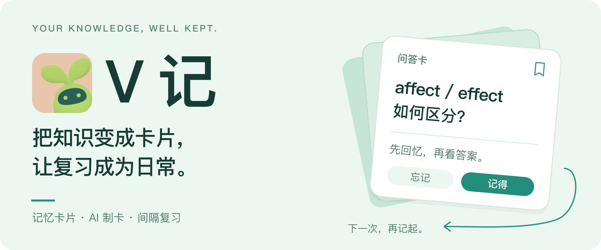
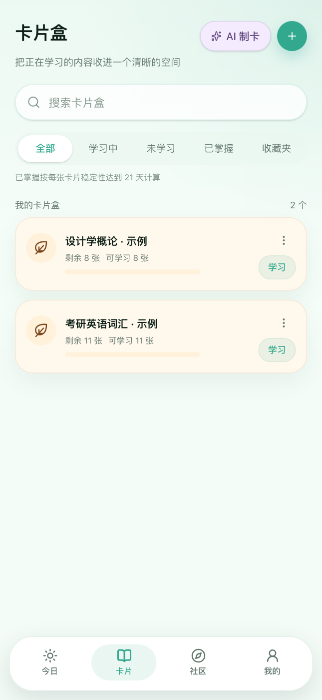
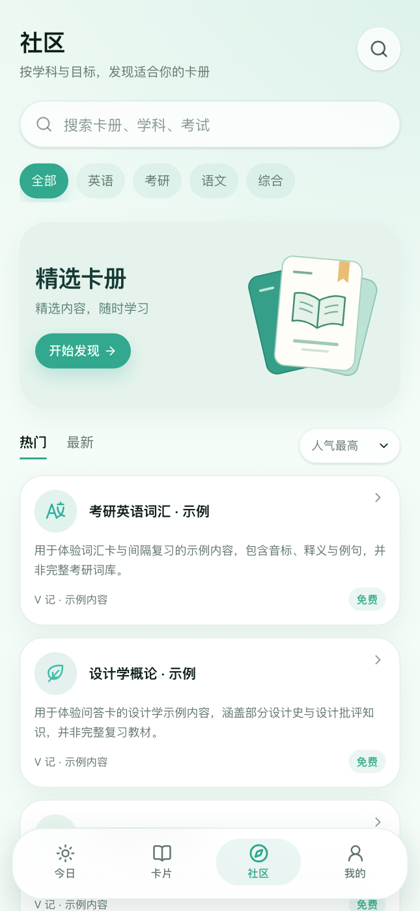
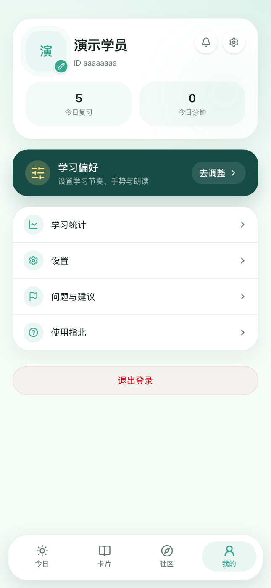
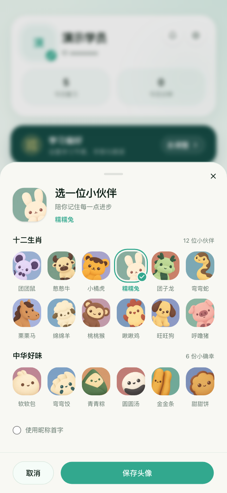

<p align="center">
  
</p>

**V 记**是一款以卡片为中心的学习工具。把知识整理成问题，先回忆、再看答案，再根据记忆情况安排下一次复习。支持手动制卡、AI 生成草稿，以及社区卡册浏览与加入。

<p align="center">
  <a href="#界面预览">界面预览</a> ·
  <a href="#从知识到记忆">学习方式</a> ·
  <a href="#本地运行">本地运行</a> ·
  <a href="#当前边界">当前边界</a>
</p>

## 界面预览

**今天学什么，一眼看清。每张卡片，先想再翻。**

以下截图拍摄于 **2026-09-26**，来自当前本地开发版的真实页面。部分界面与交互更新尚未合入 `main`；这里是开发进展预览，实际部署可能与截图不同。

<p align="center">
  
  
</p>

**卡片盒与社区：整理自己的内容，也从现成卡册开始。**

<p align="center">
  
  
</p>

<details>
<summary>个人空间与小伙伴头像</summary>

<p align="center">
  
  
</p>

18 款预设头像，包括十二生肖和 6 种食物主题。选择时先预览，保存后同步到个人资料；也可以使用昵称首字头像。

</details>

截图中的学习量、打卡和卡片来自演示账号当时的数据，不代表产品用户规模；头像面板展示的是保存前的选择预览。

## 从知识到记忆

1. **整理成卡片。** 新建卡片盒，手动记录知识；也可以放入资料，让 AI 生成卡片草稿，预览、修改后选择导入。
2. **先主动回忆。** 打开今日任务，先在心里作答，再翻看答案。支持点按、左右滑动与浏览器朗读。
3. **按记忆情况复习。** 选择「忘记 / 困难 / 记得 / 简单」，由 FSRS 安排下次复习时间。今日队列先呈现到期卡片，再加入每日额度内的新卡。

### 当前开发版更新

| 使用位置 | 当前开发版的行为 |
| --- | --- |
| 今日 | 按实际学习记录显示最近 7 天打卡和今日新卡目标；展示待学队列与近期卡盒 |
| 卡片盒 | 输入即筛选；按学习状态或收藏查找；提供重命名、图标修改与删除入口 |
| 学习 | 支持收藏、朗读 / 停止、暂时跳过当前卡片，以及编辑、暂停复习和学习设置入口 |
| 卡片管理 | 支持搜索、收藏、暂停 / 恢复、跨卡盒移动；长列表分批显示 |
| 社区 | 分类与排序、分批浏览、章节展开预览；已加入的卡册可直接打开个人副本 |
| 设置 | 每日新卡上限、目标记忆率、左右滑动动作、朗读语言 / 音色 / 语速、页面内学习提醒 |

卡盒的“已掌握”要求其中未暂停的卡片都处于复习状态，且稳定性达到 21 天。

社区的“人在学”按当前保有已加入副本的独立账号统计，排除演示账号；0 人不显示，1 人及以上显示准确人数。重复加入不重复计数，删除副本后不再计入。它表示加入人数，不是同时在线人数。

### 六种卡片，各有用处

| 模板 | 适合整理的内容 |
| --- | --- |
| 问答题 | 一面问题，一面答案；练习概念与易混点 |
| 选择题 | 单选题的题干、选项、答案与解析 |
| 挖空 | 从正文中挖去关键词，练习准确回忆 |
| 英语单词 | 单词、音标、释义与例句 |
| 古诗文 | 原文、译文与作者 |
| 笔记卡 | 用标题与正文归纳知识 |

社区现有「入党积极分子 · 党课与题库」和「湖北省选调 · 省情与时政」两套资料卡册，保留来源、章节和资料年份；内容范围与已知缺损见[整理说明](./docs/community-presets.md)。示例卡册用于体验卡型，会在标题与介绍中明确标注。

### AI 帮你整理，你来确认

资料输入 → 选择题型与生成要求 → 生成草稿 → 预览和编辑 → 选择导入卡片盒。

目前提供粘贴文字、TXT / Markdown、图片和 PDF 的输入入口，可调整题型、卡片数量、详略与版式。草稿带有来源定位入口，便于对照资料检查；失败时提供重试入口，导入前仍可编辑或删除草稿。

AI 功能需要在「我的 → 设置」中配置自己的 DeepSeek API Key，模型调用由服务端发起。输入入口不代表所有资料都能完整解析，具体边界见下文。

## 本地运行

准备 Node.js 20.9 或更新版本、npm，以及一个 Supabase 项目。以下安装步骤对应仓库已提交的 `main` 代码。

### 1. 安装与配置

```bash
git clone https://github.com/EricLeeK/v-ji.git
cd v-ji
npm ci
cp .env.example .env.local
```

在 `.env.local` 中填写：

| 环境变量 | 用途 |
| --- | --- |
| `NEXT_PUBLIC_SUPABASE_URL` | Supabase 项目地址 |
| `NEXT_PUBLIC_SUPABASE_PUBLISHABLE_KEY` | 浏览器使用的公开密钥 |
| `SUPABASE_SECRET_KEY` | AI 后台任务使用的服务端密钥，不应加 `NEXT_PUBLIC_` 前缀 |
| `NEXT_PUBLIC_SITE_URL` | 本地填 `http://localhost:3000`；部署时改成实际站点地址 |

### 2. 初始化数据库

在新建的 Supabase 项目中，按顺序执行以下迁移，建立业务表、访问策略、存储桶与 AI 制卡所需函数：

1. [基础表与权限](./supabase/migrations/20260914160000_init.sql)
2. [加入社区卡册](./supabase/migrations/20260914163000_join_book.sql)
3. [外键索引](./supabase/migrations/20260914164000_fk_indexes.sql)
4. [AI 制卡与卡片保存](./supabase/migrations/20260915015435_ai_cards.sql)
5. [全球上线安全与原子写入加固](./supabase/migrations/20260919010000_global_launch_hardening.sql)
6. [个人卡片图片改为私有存储](./supabase/migrations/20260919011000_private_card_images.sql)
7. [AI 用量记录 RPC](./supabase/migrations/20260919012000_ai_usage_rpc.sql)
8. [AI 用量表写入权限收紧](./supabase/migrations/20260919013000_ai_usage_write_revoke.sql)
9. [社区卡册来源、章节与版式](./supabase/migrations/20260925220000_book_note_metadata.sql)
10. [入党积极分子预设卡组](./supabase/migrations/20260925220100_party-activist.sql)
11. [湖北省选调预设卡组](./supabase/migrations/20260925220200_hubei-selected-graduates.sql)

两套考试卡组的卡型设计、来源版本和缺损处理见[整理说明](./docs/community-presets.md)。

在 Supabase Auth 中配置站点地址，并将 `http://localhost:3000/auth/callback` 加入允许的回调地址。若使用「先随便看看」，还需启用匿名登录。

### 3. 开始学习

```bash
npm run dev
```

打开 [localhost:3000](http://localhost:3000)，注册并登录。新建一个卡片盒，添加一张问答卡，进入学习并完成一次评分，即可走通首次学习流程。

<details>
<summary>关于演示账号与初始数据</summary>

登录页的「使用演示账号」使用 `demo@huaji.local` / `huaji123456`。这些凭据仅适用于已配置该账号的实例；数据库迁移不会自动创建演示账号，也不包含截图中的个人学习记录。执行考试卡组迁移后，社区会提供上述两套预设卡组。新部署可以直接注册自己的账号开始使用。

</details>

## 当前边界

- <strong>AI 与资料格式：</strong>当前接入 DeepSeek，具体模型见 [provider.ts](./lib/ai/provider.ts)。PDF 使用文字层提取，扫描件没有完整 OCR 流程；图片解析依赖所接模型的视觉能力。Office 文档、网页链接、音频和视频尚无导入入口。
- <strong>离线：</strong>提供 PWA 安装、静态资源缓存与离线提示；已经载入的卡盒可在本地筛选。私有页面不作为离线数据缓存，完整离线制卡、复习写入及恢复联网后的同步尚未实现。
- <strong>学习提醒：</strong>开发版在页面保持打开时按设定时间提醒，通知权限允许时可使用系统通知；关闭网页或退出 PWA 后没有后台定时推送，后台页面也受浏览器调度影响。
- <strong>社区：</strong>支持浏览卡册与免费加入；付费购买和用户发布卡册尚未实现。

## 开发说明

Next.js 16 / React 19 构建界面，Supabase 提供认证、数据与文件存储，ts-fsrs 负责复习调度。AI 制卡使用 Workflow 执行后台流程，Serwist 提供 PWA 缓存基础。

<details>
<summary>目录与常用命令</summary>

| 路径 | 内容 |
| --- | --- |
| [`app/`](./app) | 页面、认证回调与服务端操作 |
| [`components/`](./components) | 卡片编辑器、复习界面与 AI 草稿工作区 |
| [`lib/srs/`](./lib/srs) | 今日队列与 FSRS 调度 |
| [`lib/ai/`](./lib/ai) | 资料提取、模型调用、校验与生成流程 |
| [`supabase/migrations/`](./supabase/migrations) | 数据结构、访问策略与数据库函数 |

```bash
npm run dev       # 本地开发
npm run build     # 生产构建
npm run start     # 启动已构建的应用
npm run lint      # 静态检查
npm test          # 单元测试
npm run test:e2e  # 浏览器流程测试
```

浏览器测试需要可用的 Supabase 配置和演示账号。涉及写入的测试请使用独立测试实例；当前开发版的 E2E 临时卡盒按唯一名称创建，结束时清理并回读确认。

</details>
