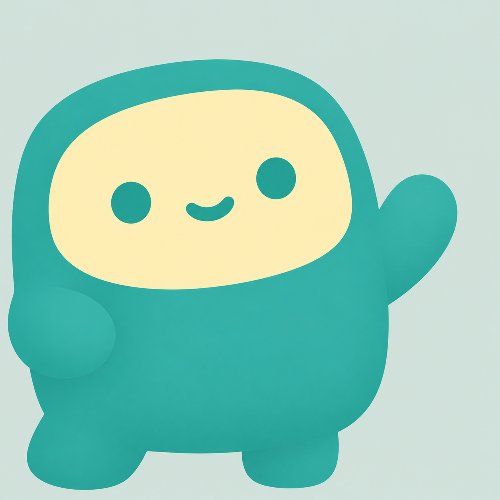
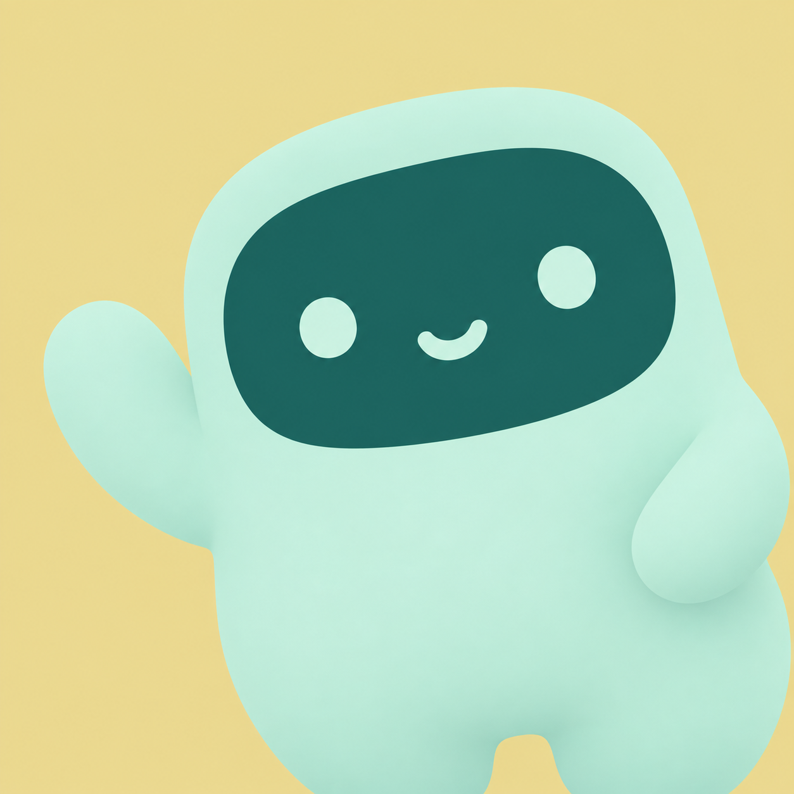
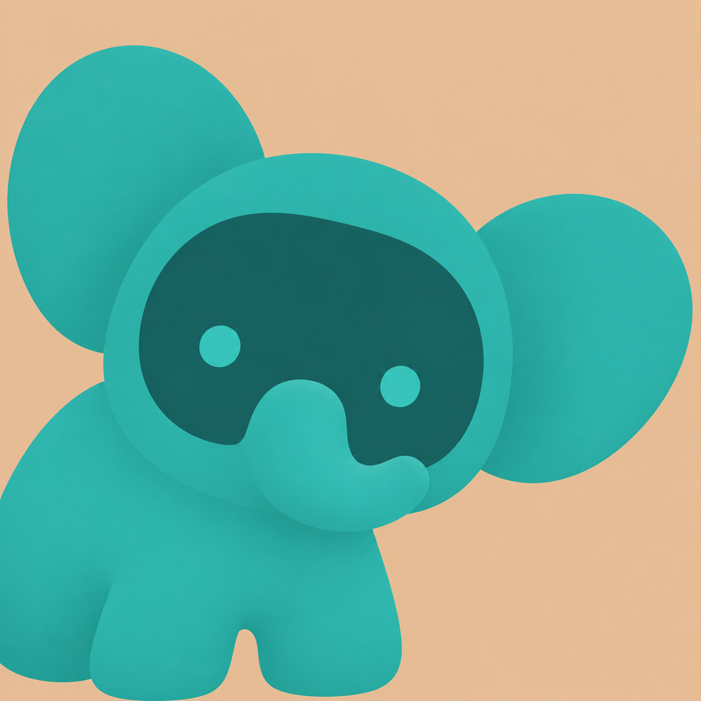
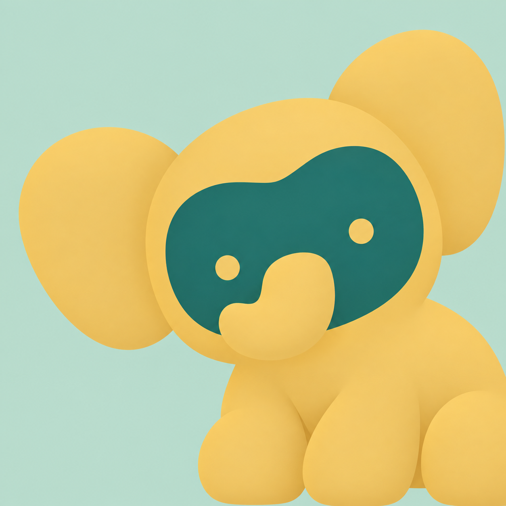
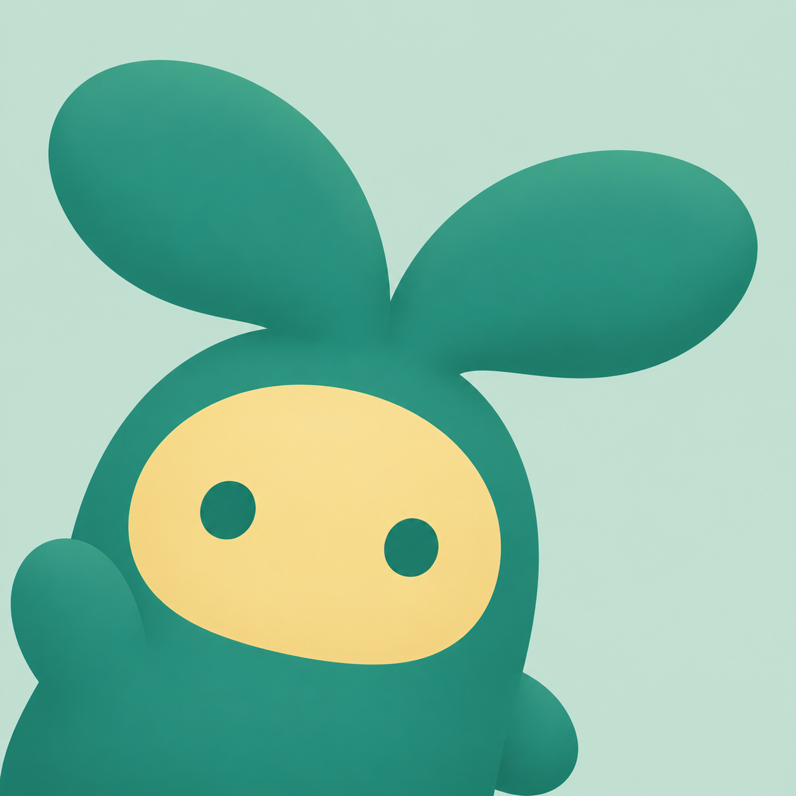
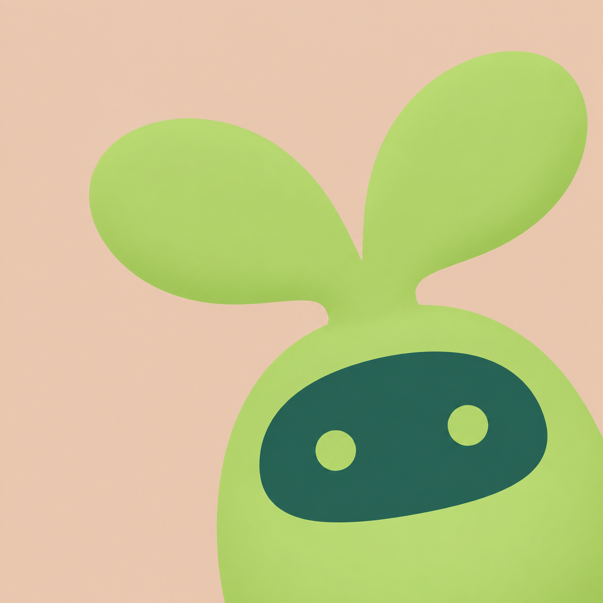

# V 记 · IP 图标候选

本轮按用户确认的三个方向生成六张独立候选。产品依据：仓库 README 中的卡片学习、主动回忆、间隔复习；现有主题青绿 `#2AA89A` 与薄荷绿 `#D7E4DF`。

| 编号 | 方向与含义 | 构图 | 角色主色 / 第二色 | 纯色背景 |
| --- | --- | --- | --- | --- |
| A1 | 卡片精灵：知识卡片成为学习伙伴 | 左下 | `#2AA89A` / `#FFF0B8` | `#D7E4DF` |
| A2 | 卡片精灵：知识卡片成为学习伙伴 | 右下 | `#C7EBDD` / `#175F59` | `#EBDD9C` |
| B1 | 记忆小象：记得更牢的形象隐喻 | 左下 | `#36ADA3` / `#155A55` | `#E8C5A0` |
| B2 | 记忆小象：记得更牢的形象隐喻 | 右下 | `#EBC76D` / `#206C62` | `#BEDDD0` |
| C1 | 新芽宝宝：每日复习带来的成长，双叶呼应 V | 左下 | `#248A74` / `#F3DB8B` | `#C9E2D5` |
| C2 | 新芽宝宝：每日复习带来的成长，双叶呼应 V | 右下 | `#B4D66C` / `#205F51` | `#E9CBB5` |

使用内置 ImageGen 工具；工具未公开实际模型名称。约束采用 `main-prompt constraints`。每张图单独生成一次，保留原始结果，无自动重绘、筛选或图像后处理。以上颜色与构图是生成意图，不代表对随机输出的逐像素验证。

精确提示词与生成元数据分别保存在 `A-prompts.json`、`B-prompts.json`、`C-prompts.json`。用户已选定 C2，已接入登录页、浏览器 favicon、Apple 桌面图标与 PWA 安装图标；原图保持不变，仅导出所需尺寸。未发布上线。

所有六张图片的原生尺寸均为 **1254 × 1254**，保留生成器返回尺寸，没有放大。

| A1 · 卡片精灵 · 左下 | A2 · 卡片精灵 · 右下 |
| --- | --- |
|  |  |

| B1 · 记忆小象 · 左下 | B2 · 记忆小象 · 右下 |
| --- | --- |
|  |  |

| C1 · 新芽宝宝 · 左下 | C2 · 新芽宝宝 · 右下 |
| --- | --- |
|  |  |
